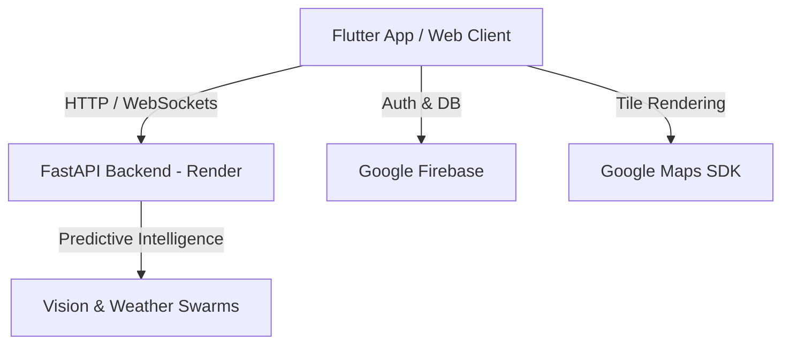

# ZEUS Smart City AI - Cognitive Crisis & Traffic Intelligence

Welcome to the **ZEUS Smart City AI** platform—a premium, state-of-the-art cognitive urban command center engineered for real-time traffic optimization, crisis prediction, and decentralized swarm coordination.

The platform is designed to run seamlessly across **Flutter Web, Android, iOS**, and is powered by a high-availability **FastAPI Python backend** with deep integration of Google Maps SDK, Firebase Cloud Messaging, and Vision Convolutional Models.

---

## 🚀 Key Features

* **Cinematic Onboarding System**: 7-page immersive, responsive user journey detailing weather grids, crisis detection, bypass systems, and chatbot gateways.
* **Smart Traffic Intelligence**: Swarm routing algorithms dynamically recalculating routes around real-time flooded areas.
* **AI Emergency Detection**: Direct upload, preview, and convolutional intelligence parsing of local citizen disaster logs.
* **Decentralized Swarm Coordination**: Direct logging of tactical simulation models.
* **AI Chatbot Command Center**: Natural Language Processing interface in Roman Urdu/English with voice support and text-to-speech.

---

## 🛠️ Architecture



### Stack Components
1. **Frontend Client**: Flutter (Dart) using Riverpod State Management, GoRouter, and Glassmorphic modern layouts.
2. **Backend Engine**: FastAPI (Python 3.10) hosting active intelligence pipelines and predictive modules.
3. **Data & Auth Layer**: Google Firebase Authentication, Firestore Database, and Firebase Cloud Storage.

---

## 📦 Setting Up Environment Variables

Create a `.env` file inside the `frontend` or root directory with the following variables:

```bash
# Google Maps Configuration
GOOGLE_MAPS_API_KEY="AIzaSy..."

# API Endpoints
ZEUS_BACKEND_BASE_URL="https://zeus-smart-city.onrender.com"
ZEUS_BACKEND_WS_URL="wss://zeus-smart-city.onrender.com"
```

---

## 💻 Local Quickstart

### Prerequisite Setup
* Flutter SDK (3.22.0+ recommended)
* Python 3.10+
* Android Studio / Gradle dependencies for mobile development

### Run Frontend Client
```bash
cd frontend
flutter pub get
flutter run -d chrome # To run the Flutter Web build
flutter run -d <android-device-id> # To run on mobile
```

### Run Python Backend (Optional - Cloud Live Endpoint is active)
If you wish to test local backend changes:
```bash
cd backend
pip install -r requirements.txt
uvicorn main:app --reload --port 8000
```
Then update `frontend/lib/core/constants/api_constants.dart` to point to `http://localhost:8000`.

---

## 🌐 Production Deployment

### 1. Backend (Render)
The backend is configured to build and deploy automatically via Render:
* Live API Base URL: `https://zeus-smart-city.onrender.com`

To deploy updates, push to the connected git repository.

### 2. Flutter Web Hosting
Build and release the production web bundle:
```bash
flutter build web --release --web-renderer canvaskit
```
Deploy the contents of `build/web` to your preferred static hosting platform (e.g., Firebase Hosting, Vercel, or Netlify).